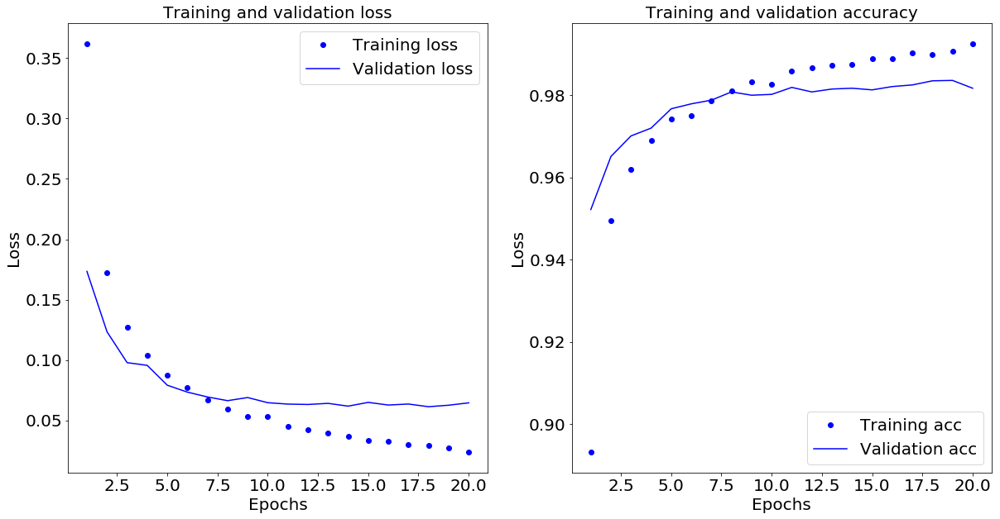

In this post, I will quickly solve the classification problem of grayscale images of handwritten digits using Keras. This data set, also called MNIST, is classic. It contains tenths of thousand of handwritten numbers (28x28 pixels), and the classification task is to categorize them into their ten categories: 0 to 9. 

The dataset contain 60K traning images (which we will further separate to train and dev sets) plus 10K test images. The data were gathered by the [National Institute of Standards and Technology](https://www.nist.gov/)y in the 1980s. To the deep-learning community solving the MNIST problem is like printing “Hello World” as is custom for any computer science major.

The MNIST dataset comes pre-loaded in Keras as a set of Numpy arrays. train_images and train_labels come form the "training set," the data that the model will learn from. Later on, we will split the train set (train_images and train_labels) into train and dev sets. Our model will be tested against the "test set," containing test_images and test_labels. Our images are encoded as Numpy arrays, and the labels are simply an array of digits, ranging from 0 to 9. There is a one-to-one correspondence between the images and the labels.


Let us look on a few of the images


Next, we build a simple one layer newral network that contains 512 nuerons. I order to aviod overfitting we use dropout of 50%. The last layer uses 10 neurons using softmax activation that will output the probability of each image being one of the ten categories. 


```python
import keras
from keras.datasets import mnist
(train_images, train_labels), (test_images, test_labels) = mnist.load_data()
train_images.shape
```


    (60000, 28, 28)


```python
train_images[10,:,:]
```


    (28, 28)


```python
from keras import models
from keras import layers
model = models.Sequential()
model.add(layers.Dense(512, activation='relu', input_shape=(28 * 28,)))
model.add(layers.Dropout(0.5))
model.add(layers.Dense(10, activation='softmax'))
model.compile(optimizer='adam',
                loss='categorical_crossentropy',
                metrics=['accuracy'])
train_images = train_images.reshape((60000, 28 * 28))
train_images = train_images.astype('float32') / 255

test_images = test_images.reshape((10000, 28 * 28))
test_images = test_images.astype('float32') / 255
from keras.utils import to_categorical

train_labels = to_categorical(train_labels)
test_labels = to_categorical(test_labels)
val_train_images = train_images[:10000,:]
partial_train_images = train_images[10000:,:]

val_train_labels = train_labels[:10000,:]
partial_train_labels = train_labels[10000:,:]
history = model.fit(partial_train_images, 
                    partial_train_labels, 
                    epochs=20, 
                    batch_size=128, 
                    validation_data=(val_train_images, val_train_labels))
```

    Train on 50000 samples, validate on 10000 samples
    Epoch 1/20
    50000/50000 [==============================] - 8s 161us/step - loss: 0.3619 - acc: 0.8932 - val_loss: 0.1734 - val_acc: 0.9522
    Epoch 2/20
    50000/50000 [==============================] - 7s 149us/step - loss: 0.1724 - acc: 0.9496 - val_loss: 0.1234 - val_acc: 0.9651
    Epoch 3/20
    50000/50000 [==============================] - 7s 141us/step - loss: 0.1273 - acc: 0.9619 - val_loss: 0.0979 - val_acc: 0.9701
    Epoch 4/20
    50000/50000 [==============================] - 7s 147us/step - loss: 0.1039 - acc: 0.9690 - val_loss: 0.0956 - val_acc: 0.9720
    Epoch 5/20
    50000/50000 [==============================] - 7s 131us/step - loss: 0.0874 - acc: 0.9742 - val_loss: 0.0792 - val_acc: 0.9767
    Epoch 6/20
    50000/50000 [==============================] - 6s 125us/step - loss: 0.0774 - acc: 0.9750 - val_loss: 0.0735 - val_acc: 0.9779
    Epoch 7/20
    50000/50000 [==============================] - 7s 147us/step - loss: 0.0668 - acc: 0.9786 - val_loss: 0.0695 - val_acc: 0.9788
    Epoch 8/20
    50000/50000 [==============================] - 7s 139us/step - loss: 0.0597 - acc: 0.9811 - val_loss: 0.0664 - val_acc: 0.9808
    Epoch 9/20
    50000/50000 [==============================] - 6s 120us/step - loss: 0.0533 - acc: 0.9833 - val_loss: 0.0690 - val_acc: 0.9800
    Epoch 10/20
    50000/50000 [==============================] - 6s 122us/step - loss: 0.0533 - acc: 0.9826 - val_loss: 0.0647 - val_acc: 0.9802
    Epoch 11/20
    50000/50000 [==============================] - 7s 132us/step - loss: 0.0450 - acc: 0.9858 - val_loss: 0.0636 - val_acc: 0.9819
    Epoch 12/20
    50000/50000 [==============================] - 7s 145us/step - loss: 0.0423 - acc: 0.9866 - val_loss: 0.0632 - val_acc: 0.9808
    Epoch 13/20
    50000/50000 [==============================] - 6s 129us/step - loss: 0.0397 - acc: 0.9872 - val_loss: 0.0642 - val_acc: 0.9815
    Epoch 14/20
    50000/50000 [==============================] - 6s 121us/step - loss: 0.0368 - acc: 0.9874 - val_loss: 0.0619 - val_acc: 0.9817
    Epoch 15/20
    50000/50000 [==============================] - 7s 130us/step - loss: 0.0332 - acc: 0.9889 - val_loss: 0.0650 - val_acc: 0.9813
    Epoch 16/20
    50000/50000 [==============================] - 10s 208us/step - loss: 0.0326 - acc: 0.9890 - val_loss: 0.0628 - val_acc: 0.9821
    Epoch 17/20
    50000/50000 [==============================] - 6s 119us/step - loss: 0.0301 - acc: 0.9902 - val_loss: 0.0636 - val_acc: 0.9825
    Epoch 18/20
    50000/50000 [==============================] - 6s 129us/step - loss: 0.0293 - acc: 0.9899 - val_loss: 0.0614 - val_acc: 0.9835
    Epoch 19/20
    50000/50000 [==============================] - 9s 175us/step - loss: 0.0273 - acc: 0.9906 - val_loss: 0.0626 - val_acc: 0.9836
    Epoch 20/20
    50000/50000 [==============================] - 8s 157us/step - loss: 0.0238 - acc: 0.9925 - val_loss: 0.0646 - val_acc: 0.9817


```python
history_dict = history.history
history_dict.keys()
test_loss, test_acc = model.evaluate(test_images, test_labels)
```

    10000/10000 [==============================] - 1s 74us/step


```python
print('test_acc:', test_acc)
```

    test_acc: 0.9819


```python
import matplotlib.pyplot as plt

plt.figure(figsize=(20,10))

plt.subplot(121)
loss_values = history_dict['loss']
val_loss_values = history_dict['val_loss']
epochs = range(1, len(loss_values) + 1)
plt.plot(epochs, loss_values, 'bo', label='Training loss')
plt.plot(epochs, val_loss_values, 'b', label='Validation loss')
plt.title('Training and validation loss',fontsize=20)
plt.xlabel('Epochs',fontsize=20)
plt.ylabel('Loss',fontsize=20)
plt.legend(fontsize=20)
plt.xticks(fontsize=20)
plt.yticks(fontsize=20)


plt.subplot(122)
acc_values = history_dict['acc']
val_acc_values = history_dict['val_acc']
epochs = range(1, len(loss_values) + 1)
plt.plot(epochs, acc_values, 'bo', label='Training acc')
plt.plot(epochs, val_acc_values, 'b', label='Validation acc')
plt.title('Training and validation accuracy',fontsize=20)
plt.xlabel('Epochs',fontsize=20)
plt.ylabel('Loss',fontsize=20)
plt.legend(fontsize=20)
plt.xticks(fontsize=20)
plt.yticks(fontsize=20)
plt.show()
```





